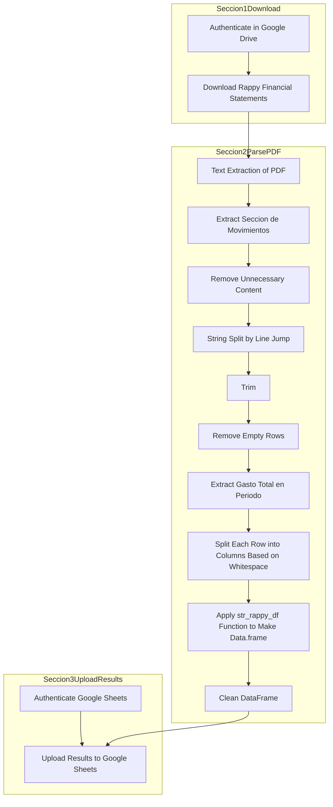

# OCR-Bank-Statements
demo repo for OCR Bank Statements so I dont have to manually input information or give it to some third party

## Rappy Parsing Workflow

```mermaid
graph TB

subgraph Seccion1Download
    A[Authenticate in Google Drive]
    B[Download Rappy Financial Statements]
end

subgraph Seccion2ParsePDF
    C[Text Extraction of PDF]
    D[Extract Seccion de Movimientos]
    E[Remove Unnecessary Content]
    F[String Split by Line Jump]
    G[Trim]
    H[Remove Empty Rows]
    I[Extract Gasto Total en Periodo]
    J[Split Each Row into Columns Based on Whitespace]
    K[Apply str_rappy_df Function to Make Data.frame]
    N[Clean DataFrame]
end

subgraph Seccion3UploadResults
    L[Authenticate Google Sheets]
    M[Upload Results to Google Sheets]
end

A --> B
B --> C
C --> D
D --> E
E --> F
F --> G
G --> H
H --> I
I --> J
J --> K
K --> N
L --> M
N --> M

```
